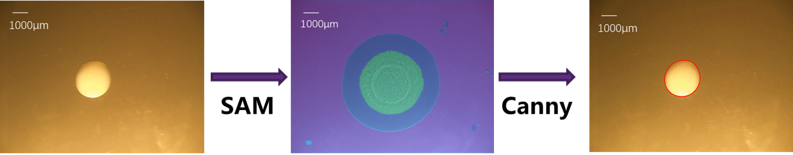
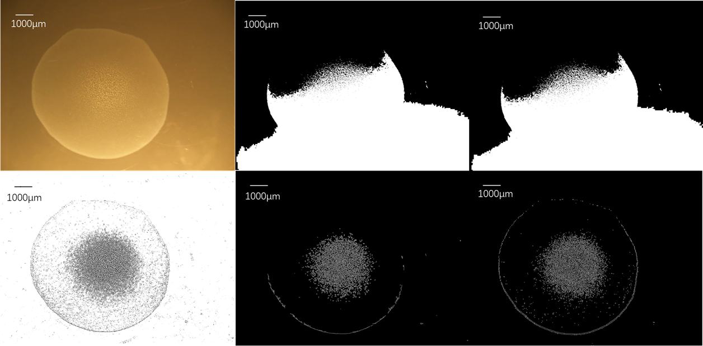
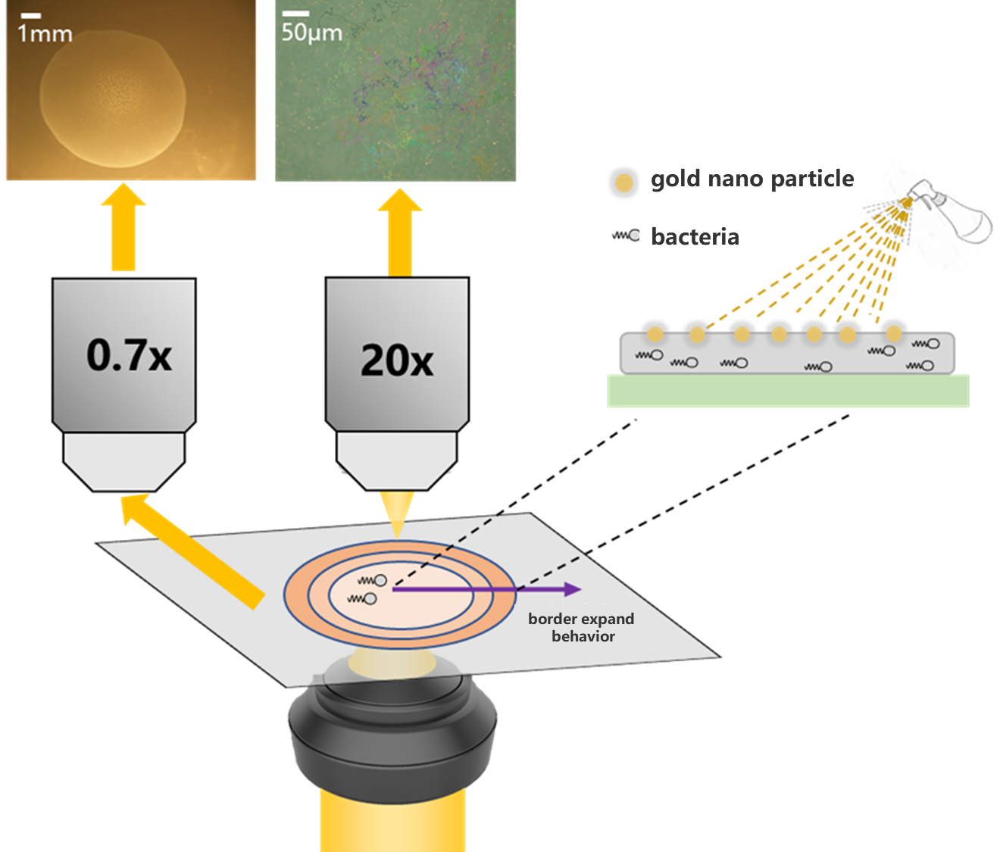
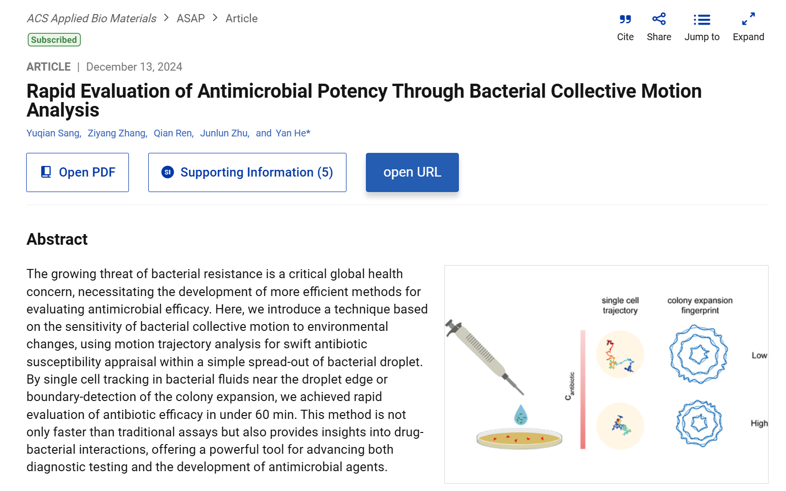

# SAM_border_recognition
 This is the final edition👀 of recognizing the bacteria's border using SAM(Segment Anything Meta)+ Canny detecting algorithmⓂ

## 0 What we are trying to do

What we are trying to do is to use this code to recognize the expantion of bacteria's border:  

The reason why we use SAM is that we found hard to use Canny or threshold segmentation to get the border:  

And we find that SAM is good at segmentation so we use it the get the mask and than use mask + Canny to get the border.  

The data comes from the below system:  

All the work has been published [here](https://pubs.acs.org/doi/10.1021/acsabm.4c01442) in acs:  🎉

## 1 Code Introduction

The code is stored in the [code](./code)，its iner distribution we can use the following file tree to represent:

├─0_preprocess  
│   
├─1_SAM_image_detect  
│  
├─2_check  
│  └─video_produce  
│       
├─3_time_fingerprint  
│    
└─4_timefinger_bar_drawing  

The [0_preprocess](./data/0_preprocess) is used to rename the file, so we can use [rename.py](./code/0_preprocess/rename.py) to realize it. The name comparisiontable is stored in the [rename_table](./data/ComparisionTable.xlsx)

The [1_SAM_image_detect](./code/1_SAM_image_detect) is used to get the border data. After using it to recognize, we need to check the recognization failed frame, and we can use the [count_blank_files.py](./code/0_preprocess/count_blank_files.py) to achieve it

After checking the failure files, we need to change the filters to recoginzed again

This code doesn't use the streaming reading, so it will cost plenty of memory

The [2_check](./code/2_check) is used to generate the check video of the above generated data

The [3_time_fingerprint](./code/3_time_fingerprint) is used to draw time finger plot

The [4_timefinger_bar_drawing](./code/4_timefinger_bar_drawing) is used to draw the scale bar of the time-finger plot

## 2 Data Storage

All the data are stored in the [data](./data) folder  

The distribution is given in the following:  
├─output_timefinger  
│  
├─check_result  
│  
├─origin_data  
│  
├─ComparisonTable.xlsx  
│    
├─output_video  
│    
├─Intermediate_variables  
│    
├─output_video  
│    
└─recognized_border_data  

The [origin_data](./data/origin_data)  is used to store the output of origin data. each data's format is tiff  

The [recognized_border_data](./data/recognized_border_data) is used to store the output of [1_SAM_image_detect](./code/1_SAM_image_detect)   

The [check_result](./data/check_result) is used to store the output of [2_check ](./code/2_check) 

The [output_timefinger](./data/output_timefinger) is used to store the output of [3_time_fingerprint](./code/3_time_fingerprint)  

The [ComparisonTable.xlsx](./data\ComparisonTable.xlsx) stores the rename results

The [output_video](./data\output_video) stores the check results video

The [Intermediate_variables](./data\Intermediate_variables) stores the intermediate variables, such as tiff img used to draw checking image, npy the SAM get

The [check_by_hand_results](./data\check_by_hand_results) stores the re-filter results, including all the border/area and check img

## 3 Model

All the model can be downloaded from https://github.com/facebookresearch/segment-anything?tab=readme-ov-file  

You can choose 1 model fit your situation best to use  

This folder [model](./model) is used to store the model downloading from the  above website  

## 4 Workflow

1. Rename：using [rename.py](./code/0_preprocess/rename.py) to rename all the data into 0000,0001 such format  
2. Generate npy: using [main.py](./code/1_SAM_image_detect/main.py) to get all the npy mask data stored in[Intermediate_variables](./data\Intermediate_variables)  
3. Check: using [check](./code/2_check) to generate check video  
4. Re-filter: using [filtered_by_hand](./code\filter_by_hand) to generate all the border we recognize and all the check image. The area and border are include in the result in [check_by_hand_results](./data\check_by_hand_results) ,area data is in the bottom of the border txt file  

## 5 Reference

[1] https://github.com/facebookresearch/segment-anything

~~~latex
@article{kirillov2023segany,
  title={Segment Anything},
  author={Kirillov, Alexander and Mintun, Eric and Ravi, Nikhila and Mao, Hanzi and Rolland, Chloe and Gustafson, Laura and Xiao, Tete and Whitehead, Spencer and Berg, Alexander C. and Lo, Wan-Yen and Doll{\'a}r, Piotr and Girshick, Ross},
  journal={arXiv:2304.02643},
  year={2023}
}
~~~

